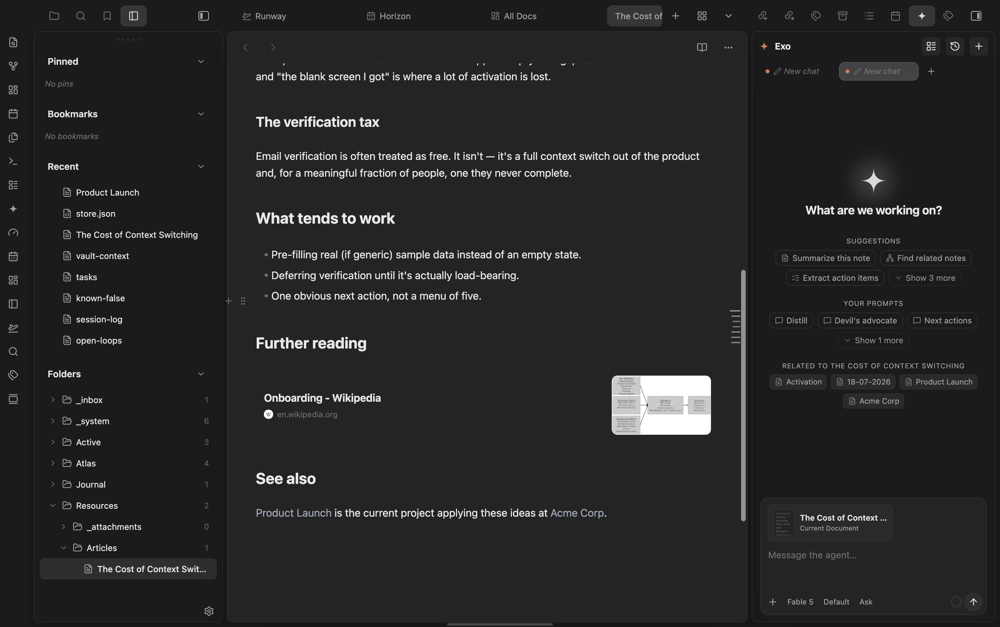

# Glance

Glance renders standalone web links as rich, Craft-style cards while keeping
the note source as ordinary Markdown.

Part of the marioverse Obsidian plugin suite.

<p align="center">
  
</p>
<p align="center"><em>A standalone link, rendered as a card with favicon, domain, and preview image.</em></p>

## What makes it different

- Source-pure rendering: displaying a card never rewrites your Markdown.
- Editable in place: the card's own controls — edit link, card size, task
  checkbox — write back to the line, and only when you click them.
- Native editing: the card becomes editable Markdown when its line is active.
- Theme-aware: all colors and typography inherit Obsidian theme tokens.
- Local-first: metadata is fetched directly and cached in plugin data.
- Cross-platform: Live Preview and Reading Mode on desktop and mobile.

## Usage

Paste an `http://` or `https://` URL on its own line. Glance fetches Open Graph
metadata and replaces the inactive line with a rich card. Move the cursor into
the line to reveal and edit the original Markdown.

Standard links are supported too:

```markdown
[Obsidian](https://obsidian.md)
```

Inline links inside sentences are intentionally left unchanged.

### Card controls

Hovering a card reveals its actions: edit the link, copy it, refresh the
metadata, switch between expanded and compact, and embed the live page.
Editing and resizing are Live Preview only — in Reading mode a card is
display-only.

### Card size

Cards render at the size set by **Default card size** in settings. Override a
single line by appending a marker:

```markdown
https://obsidian.md %%glance:compact%%
https://obsidian.md %%glance:expand%%
```

The card's size toggle writes these for you. `%%…%%` is an Obsidian comment,
so it never shows in Reading mode. A compact card keeps its image, just
narrower, and drops the description.

### Web embed

The embed action (window icon) swaps the card for the live page itself, loaded
in an iframe, rather than an unfurled preview:

```markdown
https://obsidian.md %%glance:embed%%
```

Toggling it off returns to **Default card size**. Sites that refuse to render
inside an iframe (`X-Frame-Options` or a restrictive CSP — most banks, social
networks, and many SaaS apps) show as a blank frame with no way to detect that
in advance; use **Open in browser** in the card header as the fallback.

### Lists and tasks

Links inside bullet, numbered and task items render as cards too:

```markdown
- https://obsidian.md
- [ ] https://obsidian.md %%glance:compact%%
```

In Live Preview the card draws the list marker itself — CodeMirror replaces
the whole line, so the original bullet or checkbox cannot be left standing —
and ticking a card's checkbox rewrites just that one character in the line. In
Reading mode Obsidian's own marker and checkbox stay in place.

## Commands

- **Refresh card under cursor**: invalidates metadata for the standalone link
  on the active line and fetches it again.
- **Clear metadata cache**: removes all cached previews.

## Development

```bash
pnpm install
pnpm test
pnpm lint
pnpm typecheck
pnpm build
```

## Privacy

Glance sends a request only to the URL pasted by the user. It does not use a
third-party metadata proxy or analytics service. Sites that block direct
requests fall back to a domain-only card.

## Try it

See it running in the [Obsidianverse sample vault](https://github.com/mariomile/obsidianverse-sample-vault), a small, fictional vault with the whole plugin suite pre-configured.

## License

MIT
